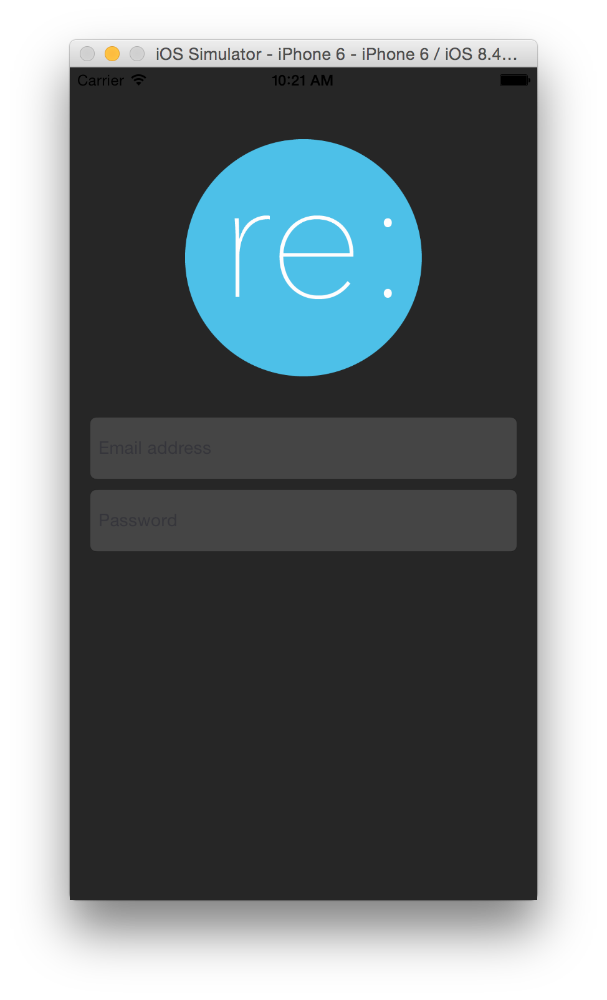
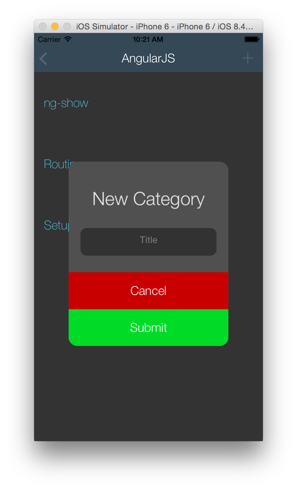
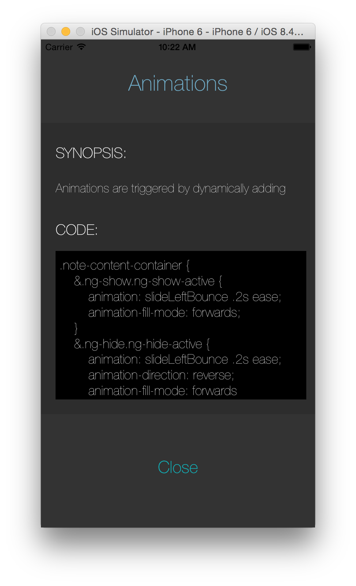
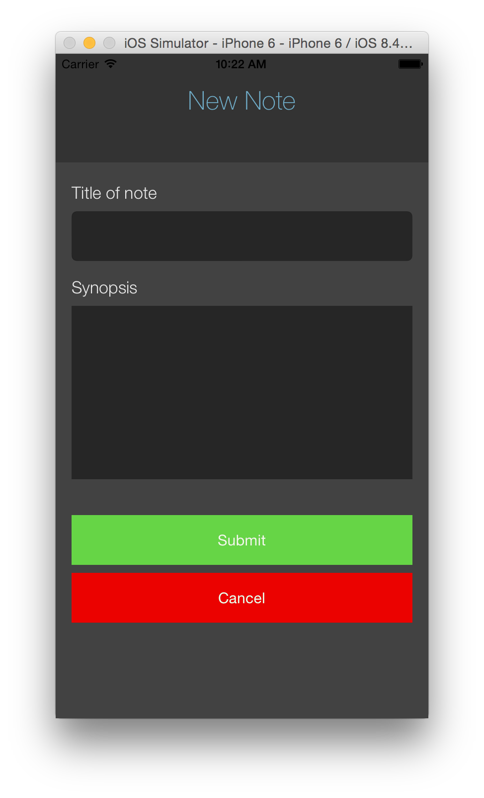

Native app for DBC final project. Very much a work in progress. 

Built with a REST API made in rails for the backend. It's been fun learning how to hook all this stuff up

If you want to download and try an account already filled out:

email: team@resource.com

password: password

progress so far:

-----------------------------------------------------

